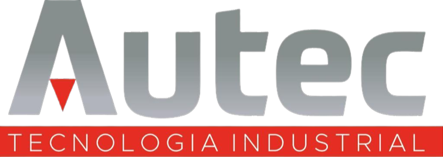

<h1 style="text-align: center">Vassago</h1>

    

    <em>Vassago</em>

## Descrição

Vassago é um sistema desenvolvido para a monitoração e manutenção remota de NVRs (Network Video Recorders) pertencentes
à AUTEC. Esse sistema permite o acompanhamento e gerenciamento eficiente dos dispositivos de vídeo de propriedade da
organização.

## Funcionalidades Principais

- Monitoramento remoto dos NVRs em tempo real.
- Acesso às câmeras de segurança em diferentes locais.
- Controle e configuração das gravações de vídeo.
- Diagnóstico e solução de problemas à distância.
- Notificações e alertas de eventos importantes.

## Requisitos do Sistema

- Conexão estável à internet.
- Dispositivo com navegador web atualizado.
- Credenciais de acesso fornecidas pela AUTEC.

## Suporte e Contato

Para obter ajuda ou relatar problemas relacionados ao Vassago, entre em contato com nossa equipe de suporte através do
e-mail daniel@autecsp.com.br ou ligue para o número (14) 97402-4740.

## Contribuição

Se você estiver interessado em contribuir para o desenvolvimento do Vassago, fique à vontade para enviar pull requests
ou relatar problemas em nosso repositório

---

## Licença

Este projeto é licenciado sob a [Licença MIT](https://mit-license.org/).

