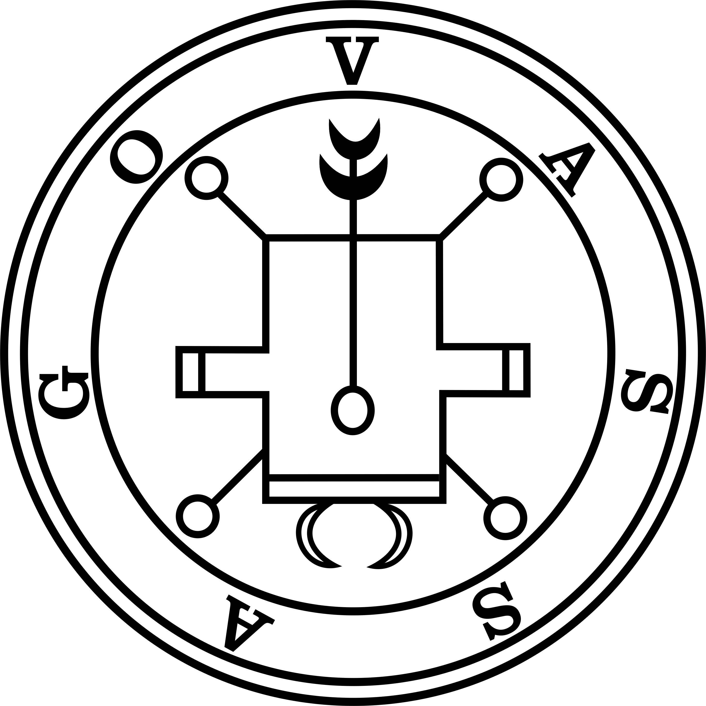

<h1 style="text-align: center">Vassago</h1>

  

Vassago, é feito em python com o uso da biblioteca Flask e banco de dados MongoDB.

Vassago, é um sistema feito para a monitoração e manutenção remota de NVRs de propriedade da AUTEC
